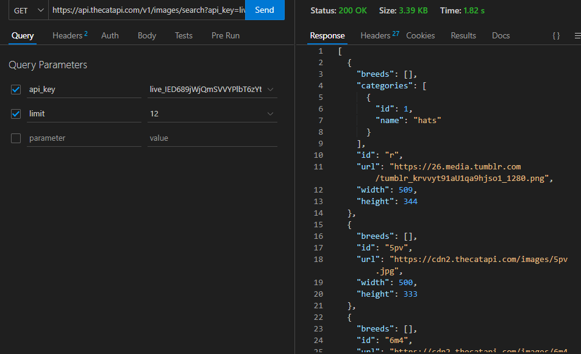
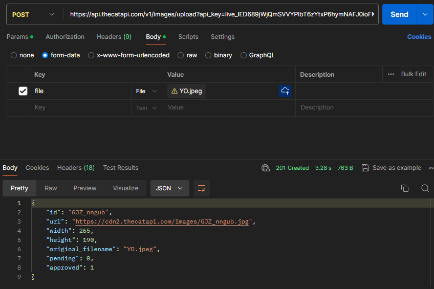
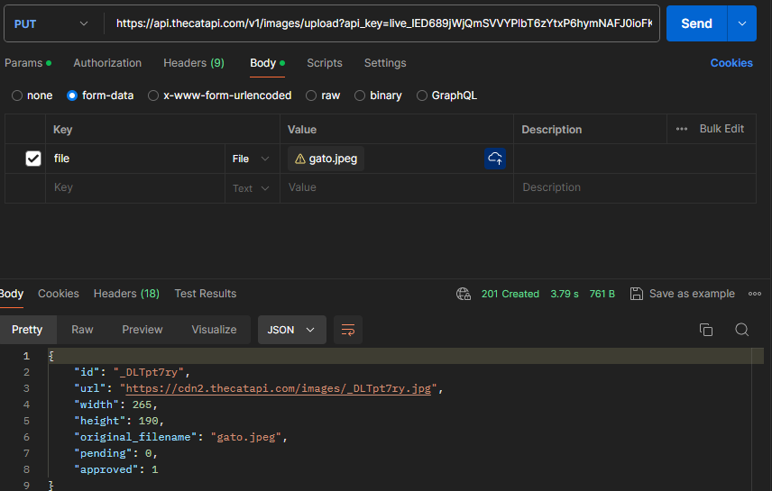
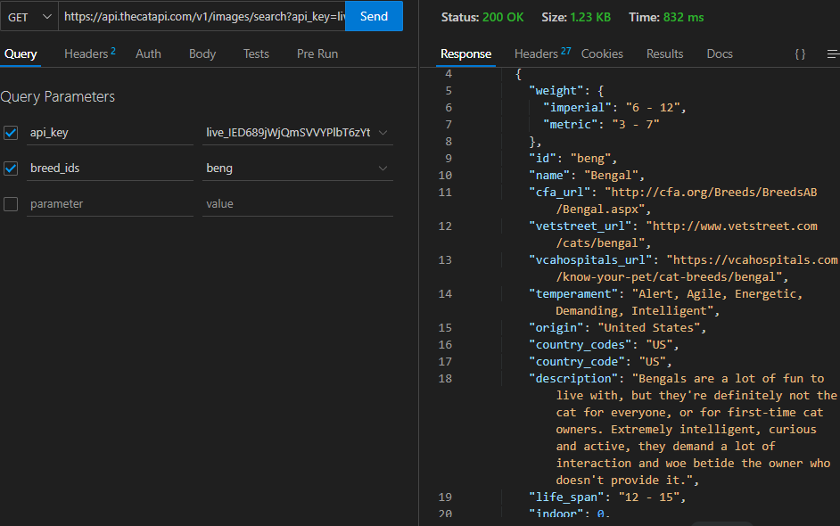
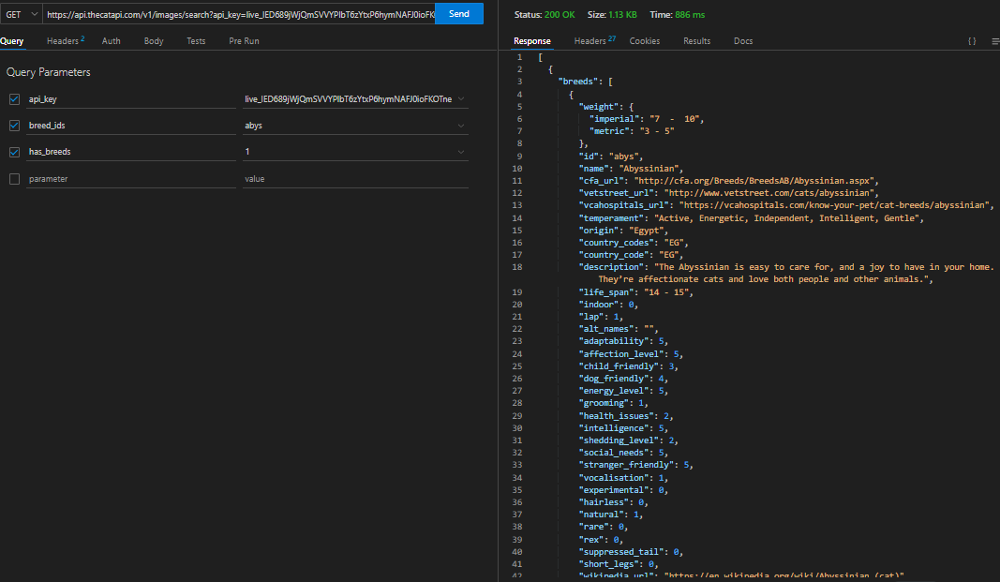
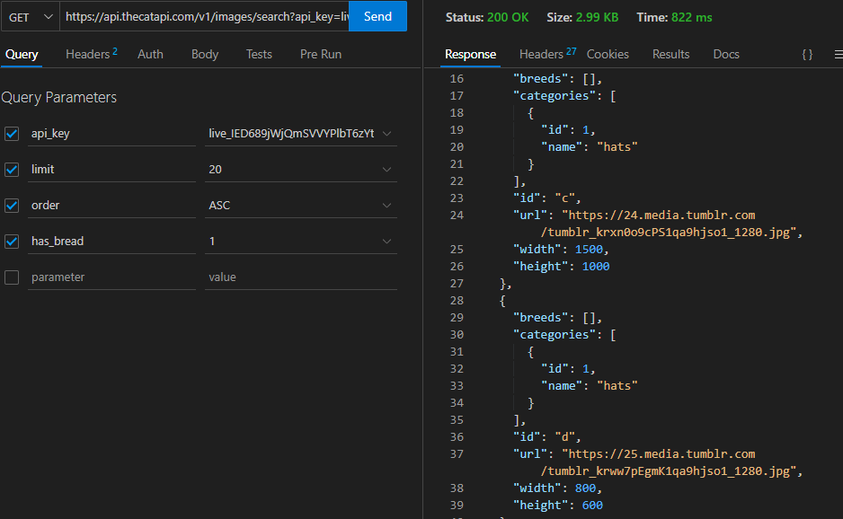

# Informe de API's 
## Alumno: Joaquin Emanuel Olmos
## Profesores: Nicolas Ledesma y Theodoro Reyna

### Indice:
    1 - Cats API
    2 - Consulta generica
    3 - Consulta POST y PUT
    4 - Consulta GET usando 1 parametro
    5 - Consulta utilizando dos claves de consulta distintas
    6 - Consulta Logica
    7 - Puntos Finales
    8 - Projecto con la API
    9 - Bibliografia

**__Cats API__**
La API de Cats es una API de RESTful que proporciona acceso a una colección de gatos. Puedes obtener información sobre los gatos, como sus imágenes, nombres, edades y descripciones.
Esta proporciona un endpoint principal para obtener informacion sobre los gatos. Se puede hacer por ejemplo una solicitud GET a **"https://api.thecatapi.com/v1/images/search"** para que te de como response una lista de imagenes de gatos, a esto le podemos agregar diferentes parametros para especificar la busqueda como el parametro "limit" para especificar el número maximo de gatos que deseamos obtener o "breed", para filtrar los gatos por raza.

**__Consulta generica__**:
    https://api.thecatapi.com/v1/images/search
    

**__Consulta POST y PUT__**:
    https://api.thecatapi.com/v1/images/upload
    
    

**__Consulta GET usando 1 parametro__**:
    Parametro usado: breed_ids
    https://api.thecatapi.com/v1/images/search
    

**__Consulta utilizando dos claves de consulta distintas__**:
    https://api.thecatapi.com/v1/images/search
    

**__Consulta Logica__**:
    https://api.thecatapi.com/v1/images/search
    

**__Puntos Finales__**
    https://api.thecatapi.com/v1/images/search
    Todo lo que se puede hacer con esta API, por lo que estuve probando a lo largo del informe, es realizar la busqueda de imagenes de gato. Por ende ya mostré lo que se puede llegar a hacer con este tipo de API.

**__Projecto Página Web__**
    [Enlace](cat.html)

**__Bibliografia__**
[Enlace a la Documentacion de la API](https://developers.thecatapi.com/view-account/ylX4blBYT9FaoVd6OhvR?report=bOoHBz-8t)
[Enlace a sintaxis de Markdown](https://tutorialmarkdown.com/sintaxis)
[Enlace a sintaxis de Markdown](https://developer.mozilla.org/es/docs/MDN/Writing_guidelines/Howto/Images_media)

